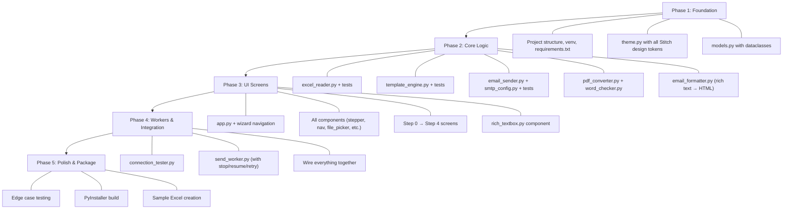

# DakBabu — Architecture Proposal (v3 — Final)

> [!NOTE]
> All open questions from v1 and v2 are now resolved. This is the final architecture ready for implementation.

---

## 1. Proposed Tech Stack

| Layer | Choice | Why |
|---|---|---|
| **Language** | Python 3.11+ | Spec mandates it |
| **GUI Framework** | [customtkinter](https://github.com/TomSchimansky/CustomTkinter) | Spec mandates adapting Stitch UI to customtkinter. Modern-looking tkinter wrapper, packages cleanly with PyInstaller |
| **Excel reading** | `openpyxl` | Standard `.xlsx` reader, no heavy deps like pandas |
| **Word templating** | `python-docx` | Read/write `.docx`, replace all `{{placeholder}}` patterns |
| **PDF conversion** | `docx2pdf` | Spec mandates it. Uses MS Word COM automation under the hood |
| **Email sending** | `smtplib` + `email` (stdlib) | SMTP with TLS, MIME multipart (HTML body + PDF attachment). Zero extra deps |
| **CSV export** | `csv` (stdlib) | Trivial |
| **Threading** | `threading` + `queue.Queue` | Background sending without freezing the UI. Queue for thread-safe status updates |
| **Packaging** | PyInstaller (`--onefile`) | Spec mandates a single `.exe` |
| **Path handling** | `pathlib.Path` only | Spec mandates it — never `os.path` |
| **Regex** | `re` (stdlib) | Scan Word docs and email body for `{{...}}` placeholder patterns |

---

## 2. Folder Structure

```
DakBabu/
├── SPEC.md                     # Product spec (stays as-is)
├── stitch_ui/                  # Stitch reference (read-only, never modified)
├── .venv/                      # Existing virtual environment
│
├── src/
│   ├── __init__.py
│   ├── main.py                 # Entry point — creates App, runs mainloop
│   │
│   ├── core/                   # Pure business logic — ZERO tkinter imports
│   │   ├── __init__.py
│   │   ├── excel_reader.py     # Read .xlsx, validate columns, detect dupes
│   │   ├── template_engine.py  # Load .docx, scan ALL {{...}} placeholders,
│   │   │                       # cross-validate against Excel columns,
│   │   │                       # replace ALL occurrences, generate personalized copies
│   │   ├── pdf_converter.py    # docx → PDF via docx2pdf, temp file management
│   │   ├── email_sender.py     # SMTP connection, test, send with attachment
│   │   ├── email_formatter.py  # Convert rich-text markup (bold/italic) to HTML
│   │   ├── smtp_config.py      # Auto-detect SMTP host/port from email domain
│   │   ├── word_checker.py     # Detect MS Word installation & version at startup
│   │   └── models.py           # Dataclasses: Recipient, SendResult, AppState
│   │
│   ├── ui/                     # All customtkinter code — ZERO business logic
│   │   ├── __init__.py
│   │   ├── app.py              # Root CTk window, wizard navigation, step management
│   │   ├── theme.py            # Stitch design tokens → CTk colors/fonts/spacing
│   │   ├── components/         # Reusable UI widgets
│   │   │   ├── __init__.py
│   │   │   ├── stepper.py      # Step indicator bar (1–2–3–4)
│   │   │   ├── nav_bar.py      # Top header bar (DakBabu + step nav)
│   │   │   ├── bottom_bar.py   # Back / Next footer
│   │   │   ├── file_picker.py  # Drag-area-style file selector
│   │   │   ├── status_badge.py # Pill badges (Sent ✓ / Failed ✗ / Sending…)
│   │   │   ├── info_box.py     # Blue info callout box
│   │   │   └── rich_textbox.py # Text editor with Bold/Italic/Underline toolbar
│   │   ├── steps/              # One frame per wizard step
│   │   │   ├── __init__.py
│   │   │   ├── step0_welcome.py    # Startup screen: Word check + instructions
│   │   │   ├── step1_credentials.py
│   │   │   ├── step2_files.py
│   │   │   ├── step3_preview.py
│   │   │   └── step4_tracker.py
│   │   └── dialogs.py          # Error/warning/confirmation popups
│   │
│   └── workers/                # Threading bridge between UI and core
│       ├── __init__.py
│       ├── connection_tester.py  # Background thread for SMTP test
│       └── send_worker.py        # Background thread for batch send loop
│                                 # with stop/resume + retry support
│
├── assets/                     # App icon, bundled files
│   ├── icon.ico                # User's branding icon (256×256 multi-size)
│   └── sample_recipients.xlsx  # Downloadable sample Excel template
│
├── tests/                      # Unit tests for core/ (no GUI tests)
│   ├── test_excel_reader.py
│   ├── test_template_engine.py
│   ├── test_smtp_config.py
│   └── test_email_sender.py
│
├── requirements.txt
├── build.spec                  # PyInstaller spec file
└── README.md
```

---

## 3. UI ↔ Core Separation Strategy

```
┌─────────────────────┐       ┌──────────────────┐       ┌─────────────────┐
│     ui/steps/*      │──────▶│   workers/*      │──────▶│    core/*       │
│  (customtkinter)    │       │  (threading)     │       │  (pure Python)  │
│                     │◀──────│                  │◀──────│                 │
│  Reads from Queue   │ Queue │  Posts to Queue   │       │  Returns data   │
└─────────────────────┘       └──────────────────┘       └─────────────────┘
```

### Rules:
- **`core/` never imports tkinter or customtkinter.** Pure Python. Reusable in CLI/web.
- **`ui/` never does file I/O, SMTP, or Excel parsing directly.** It calls workers.
- **`workers/` is the bridge.** Each worker runs in a `threading.Thread`, calls `core/` functions, and posts results back to the UI via a `queue.Queue`. The UI polls the queue using `root.after()`.

### Why this matters:
- The UI never freezes (spec: "Never block the UI during sending")
- Core logic is independently testable without a GUI
- Thread safety is centralized in the workers layer

---

## 4. Key Design Decisions

### Dynamic Placeholder Engine

The template engine supports **any number of placeholders** from Excel columns:

```
Excel columns:       Name    Email    Department    Roll_No
                     ─────   ─────    ──────────    ───────
Placeholders used:   {{name}}         {{department}} {{roll_no}}
```

**Flow:**
1. User uploads Excel → `excel_reader.py` reads the **first row as headers** (case-insensitive)
2. The `Email` column is **mandatory** (it's the send target). All other columns become available placeholders
3. Column order **does not matter**. Extra columns (like Sl. No.) are treated as normal — available as placeholders if referenced, silently ignored if not
4. User uploads Word doc → `template_engine.py` scans for **all** `{{...}}` patterns via regex
5. **Cross-validation**: every placeholder in the doc must match a column in the Excel. If not:
   - Show a clear error: *"Placeholder `{{department}}` found in document but no 'Department' column exists in your Excel file."*
   - List all missing columns. Block proceeding to next step
6. Same cross-validation for the email subject and body fields
7. **Matching is case-insensitive**: `{{Name}}` matches column header `name`, `NAME`, `Name`, etc.
8. **All occurrences replaced**: if `{{name}}` appears 5 times in a doc or email, all 5 are replaced
9. **No unused-placeholder warnings**: if a column exists in Excel but isn't used in the doc or email, that's perfectly fine — silently ignored

### Email Body — Rich Text with Basic Formatting

The email body editor supports basic formatting like a normal email composer:

**UI Component: `rich_textbox.py`**
- A `tkinter.Text` widget (wrapped in a CTk frame) with a small formatting toolbar above it
- Toolbar buttons: **B** (Bold), *I* (Italic), U̲ (Underline)
- User selects text → clicks a toolbar button → formatting is applied visually using tkinter text tags
- Placeholders (`{{name}}`, etc.) work inside formatted text

**Under the Hood: `email_formatter.py`**
- When composing the email for sending, the formatted text is converted to simple HTML:
  - Bold → `<strong>text</strong>`
  - Italic → `<em>text</em>`
  - Underline → `<u>text</u>`
  - Line breaks → `<br>`
- The email is sent as MIME multipart with `Content-Type: text/html`
- This is how every normal email client works — the user writes "normally" but it's HTML under the hood

**Preview (Step 3):**
- Shows the rendered formatted text with the first recipient's placeholders filled in
- Visually matches what the recipient will actually see

> [!IMPORTANT]
> The user never sees or writes HTML. They just type and click Bold/Italic like in Gmail or Outlook. The HTML conversion is completely invisible.

### Sample Excel Template

The app provides a **"Download Sample"** button in Step 2. The bundled `sample_recipients.xlsx` contains:

| Email | Name | Department |
|---|---|---|
| priya@example.com | Priya Sharma | Computer Science |
| rohit@example.com | Rohit Verma | Electrical |

**Instructions shown in the app** (as an info box in Step 2):
- ✅ Your Excel must have a column named **Email** — this is where emails are sent
- ✅ All other column headers become your **placeholders** (use them as `{{column_name}}` in your document or email)
- ✅ Column names and placeholder names must match (capitalization doesn't matter)
- ✅ Column order doesn't matter — put them in any order you like
- 📥 *Download a sample Excel to get started*

### MS Word Detection at Startup

Auto-detect Word programmatically — no manual checkbox:

1. On app startup, try to create a `win32com.client.Dispatch("Word.Application")` in a background thread
2. If it succeeds → get the version string, close the COM object, proceed normally
3. If it fails → show a friendly startup dialog:
   *"Microsoft Word was not found on this computer. DakBabu needs Word to convert documents to PDF. Please install Word and try again."*
4. This covers all Word versions (2007, 2010, 2013, 2016, 2019, 365, etc.)

### Retry Failed Emails

After a batch completes or is stopped:
1. Failed rows are highlighted red in the tracker table
2. A **"Retry Failed"** button appears (only if there are failed rows)
3. User clicks it → only the failed rows are re-queued
4. The tracker updates in real time again, just for those rows
5. This can be repeated until all succeed or the user gives up

### Stop & Resume

When the user clicks **Stop** on Step 4:
1. The send worker finishes the current email (doesn't abort mid-SMTP)
2. All remaining rows stay marked as **Pending**
3. Already-sent rows stay **Sent** (green)
4. The **Back** button becomes active — user can go back to Step 2/3 to fix things
5. When they come back to Step 4 and click **Resume**, only Pending rows are sent
6. Per-recipient states: `Pending | Sending | Sent | Failed`

### Responsive / Resizable Window

- **Minimum size**: 900×600
- **Default size**: 1100×750
- **Fully resizable**: Layouts use `grid` with `weight` configuration so content stretches/centers properly at any window size
- Step 1 (credentials card) → always centered
- Step 2 (file upload cards) → cards stretch horizontally, stack vertically with scroll
- Step 3 (email preview) → preview card stretches, body area grows
- Step 4 (tracker table) → table fills all available vertical space

### Password Safety
- App Password is held in a Python string variable only during the active session
- **Never written to disk** — no config files, no persistence
- Cleared from the variable when the app closes
- Password field uses `show="•"` (masked input) with a toggle-visibility button matching the Stitch design

### Rate Limit Warning
- If the Excel file contains **more than 500 recipients**, show a yellow warning in Step 2:
  *"Your list has {n} recipients. Gmail limits sending to ~500 emails/day for regular accounts. Some emails may fail due to provider limits."*
- No artificial throttling
- A small `time.sleep(0.3)` between emails purely to let the UI update smoothly

### Temp File Cleanup
- `pdf_converter.py` uses `tempfile.TemporaryDirectory` as a context manager
- `WM_DELETE_WINDOW` handler on the window does graceful cleanup on close: cancel pending threads, delete temp files
- `atexit` handler as a safety net

### SMTP Auto-Detection
- Domain → (host, port, tls) lookup table for Gmail, Outlook, Yahoo
- Falls back to manual entry if the domain isn't recognized

### Stitch Design Fidelity
- `theme.py` extracts the exact hex colors, font sizes, spacing, and border radii from DESIGN.md into Python constants
- customtkinter widgets are mapped: `fg_color`, `corner_radius`, `font`, `border_color`, `border_width`
- Pill-shaped buttons → `corner_radius=9999`
- Material icons → replaced with Unicode symbols (✓ ✗ ⚠ ℹ ← → ⏳ etc.)
- **All new screens/buttons** (Step 0 welcome, Retry Failed button, Resume button, Download Sample button) follow the exact same design language: same colors, fonts, corner radii, spacing, button styles
- The layout faithfully reproduces the Stitch screens

---

## 5. All Confirmed Assumptions

| # | Assumption | Status |
|---|---|---|
| 1 | **Multiple placeholders** from all Excel columns — all occurrences replaced | ✅ |
| 2 | **Column matching is case-insensitive** | ✅ |
| 3 | **Flexible Excel format** — only `Email` column required, order doesn't matter | ✅ |
| 4 | **Extra columns** (like Sl. No.) don't break anything — treated as normal columns | ✅ |
| 5 | **No unused-placeholder warnings** — it's up to the user which placeholders to use where | ✅ |
| 6 | **Email body supports basic formatting** (Bold, Italic, Underline) — sent as HTML | ✅ |
| 7 | **App Password only** (no OAuth). Password never saved to disk | ✅ |
| 8 | **MS Word auto-detected at startup**. All versions (2007+) supported | ✅ |
| 9 | **Warning at >500 recipients**, no artificial throttle | ✅ |
| 10 | **Retry failed emails** with selective re-queue | ✅ |
| 11 | **Stop & Resume** — user can go back and continue from where they left off | ✅ |
| 12 | **Sample Excel** bundled for download with clear instructions | ✅ |
| 13 | **Single-instance** app | ✅ |
| 14 | **Resizable window** with minimum 900×600 | ✅ |
| 15 | **All new UI elements** follow the Stitch design language exactly | ✅ |

---

## 6. App Icon — Conversion Specs

You have a `.png` file and need to convert it to `.ico`. Here are the required specs:

### Recommended `.ico` format:

| Property | Value |
|---|---|
| **Sizes to include** | 16×16, 32×32, 48×48, 64×64, 128×128, 256×256 (all in one `.ico` file) |
| **Bit depth** | 32-bit (RGBA — includes transparency) |
| **Format** | ICO (multi-resolution) |

### How to convert:

**Easiest way — use an online converter:**
1. Go to [redketchup.io/icon-converter](https://redketchup.io/icon-converter) or [icoconvert.com](https://icoconvert.com)
2. Upload your `.png`
3. Select all sizes: 16, 32, 48, 64, 128, 256
4. Select 32-bit color (with alpha/transparency)
5. Download the `.ico` file
6. Rename it to `icon.ico` and place it in `assets/icon.ico`

> [!TIP]
> Your source `.png` should be **at least 256×256 pixels** for best quality. If it's smaller, the larger sizes will look blurry.

---

## 7. Implementation Order (Once You Approve)



**All questions are resolved.** Once you approve this architecture, I'll start building Phase 1.
